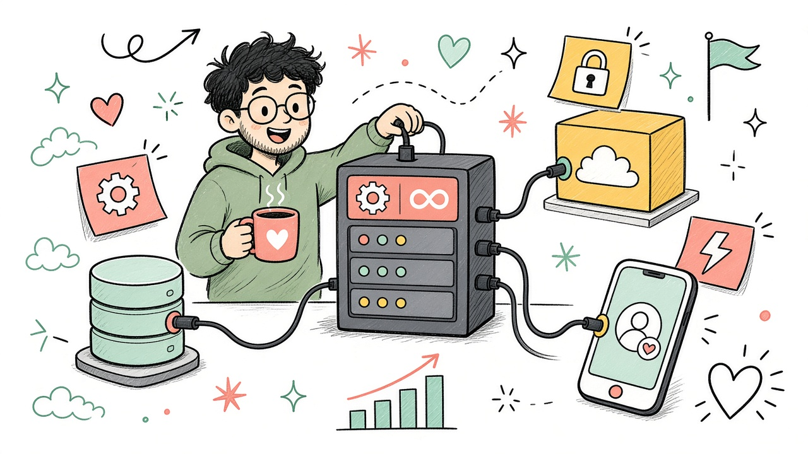

# Пара 1. Бэкендеры на рынке труда

**Бэкенд — «кухня» продукта:** API, данные, нагрузка, безопасность.  
Рынок живой, но вход для джунов такой же жёсткий, как в IT в целом.

---

## Кто такой бэкендер (одной минутой)

Пишет серверную часть:

- API для мобилки / веба
- базы данных, кэш, очереди
- авторизация, платежи, файлы
- интеграции с другими сервисами

На нашем курсе мобилка будет ходить в бэкенд (как раньше — `cloud.kit-imi.info`). Имеет смысл понимать, **что** там происходит.

---

## Что на рынке в 2026

| Факт | Смысл для тебя |
|---|---|
| Спрос на бэкенд **стабильно высокий** | Вакансий много относительно «модных» ниш |
| Берут в основном **middle / senior** | Джуну нужен портфолио и практика |
| Зарплаты у опытных **выше медианы по IT** | Но рост уже не «+20% каждый год» |
| Стек влияет на вилку | Go / Java часто дороже «массового» PHP |
| Часто просят Docker, SQL, Git | Это база, не «опциональные плюсы» |

> Цифры ниже — **ориентиры** по открытым обзорам (Habr Career, агрегаторы вакансий). Перед откликом смотри живые вилки.

---

## Зарплаты — ориентиры (РФ)

Грубо, по грейдам (очень усреднённо):

| Уровень | Ориентир |
|---|---|
| Junior / стажёр | часто ниже общей «красивой» медианы; вход конкурентный |
| Middle | часто порядка **150–220+ тыс. ₽** в зависимости от стека и города |
| Senior | нередко **250–350+ тыс. ₽**, отдельные стеки выше |
| Медиана «backend в среднем» | в обзорах часто около **220–240 тыс. ₽** (тянут middle/senior) |

По стекам (ещё грубее, senior/сильный middle тянет вверх):

| Стек | Где чаще встречается | Настроение рынка |
|---|---|---|
| **Java** | банки, enterprise, крупный бизнес | стабильный спрос |
| **Go** | highload, инфраструктура, микросервисы | меньше людей → выше вилки |
| **Python** | API, data/AI-adjacent, стартапы | много вакансий + жёсткая конкуренция |
| **Node.js / TypeScript** | фуллстек-команды, стартапы | широкий рынок |
| **C# / .NET** | корпорации, продукт | стабильно |
| **PHP** | легаси + часть веба | вакансии есть, вилки обычно скромнее |

В вакансиях часто рядом: **PostgreSQL, Docker, Redis, Kafka, Git, Linux**.

---

## Почему бэкенд «держится»

1. Без сервера нет продукта: мобилка сама по себе редко зарабатывает
2. Сложнее «нарисовать портфолио за выходные», чем лендинг — отсев случайных
3. Нужны надёжность, безопасность, данные — это дорого чинить на проде
4. ИИ пишет CRUD быстрее, но **архитектуру, инциденты и ответственность** всё ещё вешают на людей

---

## ИИ и бэкенд

ИИ хорошо помогает с:

- черновиком эндпоинта
- SQL-запросом
- тестом / миграцией
- разбором странной ошибки

ИИ плохо заменяет:

- проектирование API под нагрузку
- понимание транзакций и консистентности
- безопасность (auth, права, утечки)
- ответственность за прод в 3 ночи

Формула та же: **ты укрощаешь инструмент**.

---

## Что качать, если смотришь в бэкенд

**Минимум, без которого резюме слабое:**

1. Один язык уверенно (Python / Java / Go / Node — лучше один глубоко)
2. HTTP + REST (или понимание RPC)
3. SQL и одна реляционная БД (PostgreSQL — безопасный выбор)
4. Git, Docker «на уровне запустить»
5. Умение объяснить: *запрос пришёл → что произошло → что ушло клиенту*

**Плюсы, которые выделяют:**

- кэш (Redis), очереди (Kafka / Rabbit)
- базовый Linux
- тесты
- простой pet-проект: auth + CRUD + деплой

---

## Связь с нашим мобильным курсом

| На мобилке | На бэкенде |
|---|---|
| экраны, навигация, состояние | API, модели данных |
| Axios / fetch | роуты, валидация, статусы HTTP |
| AsyncStorage / токен | JWT, сессии, refresh |
| «посты / профиль» | таблицы, права, пагинация |

Даже если останешься в мобильной разработке, понимание бэкенда = меньше магии и сильнее на собесах.

---

## Честный вывод

1. Бэкенд на рынке **востребован сильнее многих «хайповых» ниш**
2. Деньги хорошие у тех, у кого уже есть **опыт и стек**
3. Джуну путь тот же: проекты → стажировка → первая работа месяцами, не днями
4. Выбери **один** стек и доведи до «могу объяснить свой сервис»
5. ИИ ускоряет, но оффер дают за **надёжность и понимание**

---

## Мини-чеклист

- [ ] Есть учебный API: регистрация / логин / список сущностей
- [ ] БД не «в памяти массивом», а нормальное хранилище
- [ ] README: как запустить локально
- [ ] Понимаю свой код без подсказок ИИ
- [ ] Могу на собесе нарисовать поток запроса на доске

---

*Раздатка к паре. Цифры — ориентир на 2025–2026; перед откликом сверяй hh / Habr Career.*
