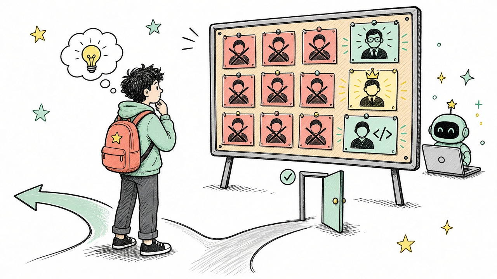

# Пара 1. Что происходит на рынке труда айтишников

**2026:** «золотая эра лёгкого входа в IT» закончилась.  
Отрасль никуда не делась — изменились правила входа.

---

## Коротко: что изменилось

| Раньше (примерно 2020–2022) | Сейчас (2025–2026) |
|---|---|
| Много вакансий, джунов брали охотнее | Вакансий меньше, конкуренция выше |
| Курсы + «Hello World» ≈ оффер | Нужны проекты, практика, понимание |
| Зарплаты росли двузначными темпами | Рост зарплат замедлился |
| ИИ почти не влиял на найм | ИИ меняет, *кого* и *зачем* нанимают |

Рынок стал **рынком работодателя**: компаний меньше «набирают всех подряд», выбирают аккуратнее.

---

## Цифры-ориентиры (РФ, 2026)

> Это **не обещание зарплаты**, а картинка рынка по открытым обзорам (hh, SuperJob, отраслевая пресса). Цифры плывут — сверяй актуальные вакансии.

- **Вакансий в IT меньше**, чем в пиковые годы; конкуренция за вход выросла
- На **junior**-позицию часто приходится **много резюме** (порядка десятка–двух на место)
- Доля вакансий **«без опыта»** в IT заметно ниже, чем в среднем по рынку
- Поиск первой работы у джуна нередко занимает **месяцы**, не «две недели»
- **Junior** (ориентир): часто вилка порядка **90–120 тыс. ₽** (Москва выше, регионы ниже)
- **Middle / Senior** по-прежнему востребованы сильнее: деньги и вакансии уходят туда
- Относительно устойчивее выглядят направления вроде **ИБ, DevOps, AI/ML, промышленный IT** — но и там без базы не берут

---

## Почему так вышло (без мифов)

1. **Первичная цифровизация** многих компаний уже прошла — «нанять 50 стажёров вчера» уже не надо
2. **Много выпускников курсов** вышли на рынок почти одновременно
3. **ИИ** закрывает часть рутинных задач, которые раньше отдавали джунам (простые правки, шаблонный код, черновики)
4. Компании чаще хотят человека, который **сразу приносит пользу**, а не только «учится на проде»

Важно: **IT не умер**. Умерла сказка «выучил за 3 месяца — и 300к удалёнкой».

---

## Что делает ИИ с профессией

ИИ **не заменяет** разработчика целиком. Он меняет планку:

| Было «джун делает» | Сейчас часто ждут |
|---|---|
| Написать простой экран по образцу | Понять задачу, предложить решение |
| Скопировать из туториала | Проверить код ИИ и объяснить, почему так |
| «Работает у меня» | Тесты, краевые случаи, читаемость |
| Знать один фреймворк | Уметь учиться и стыковать инструменты |

**Формула 2026:**  
`сильная база` + `умение работать с ИИ` + `реальные проекты`  
а не только «я умею промптить».

---

## Где шансы у студентов выше

- **Свой GitHub** с живыми проектами (не только домашки)
- **Стажировки / pet-проекты / open source** — любой след коммерческой или командной работы
- **Мобильная разработка** (наш курс): меньше «случайных» джунов, чем в веб-верстке, но и вакансий меньше — качество портфолио решает
- Умение показать: «вот приложение, вот PR, вот что я сделал сам»
- Soft skills: объяснить решение, принять фидбек, довести задачу

Слабая ставка: резюме из списка курсов без единого нормального репозитория.

---

## Честный вывод для нашей пары

1. В IT всё ещё можно хорошо зарабатывать — но **вход стал жёстче**
2. Конкурируешь не с «соседом по группе», а с сотнями резюме на hh
3. ИИ — ускоритель для тех, кто **понимает**, и ловушка для тех, кто только копирует
4. Наш курс: стек **Expo / React Native**, сдача через **GitHub** — это как раз формат портфолио, а не «тетрадка»
5. Цель семестра: не «пройти лабы», а выйти с **приложением, которое не стыдно показать**

---

## Мини-чеклист «я готов к рынку» (на вырост)

- [ ] 2–3 проекта в GitHub с README
- [ ] Понимаю свой код без ИИ рядом
- [ ] Умею читать чужой PR / чужую ошибку
- [ ] Могу за 5 минут рассказать, что делает моё приложение
- [ ] Хотя бы раз прошёл путь: идея → экран → баг → фикс → коммит

---

## Что почитать / куда смотреть

- Вакансии: [hh.ru](https://hh.ru), [Habr Career](https://career.habr.com), SuperJob
- Зарплатные ориентиры: обзоры Habr Career / SuperJob (обновляются каждый квартал)
- Про ИИ и джунов: дискуссии в отраслевой прессе 2025–2026 — тезис один: **планка входа выросла**

---

*Раздатка к паре про ИИ-помощников. Рынок меняется быстрее учебника — перепроверяй цифры перед собеседованием.*
