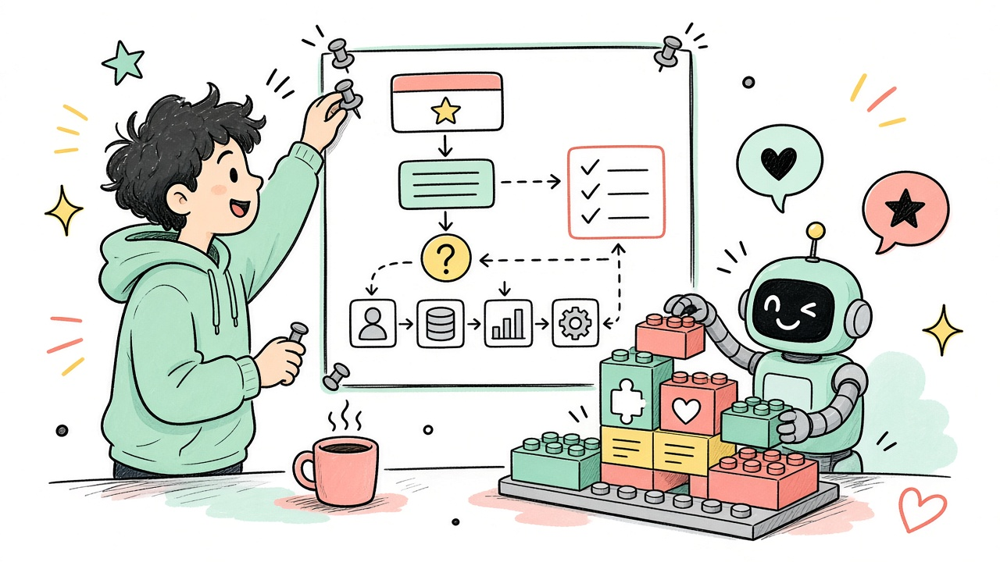

# Пара 1. SDD — Spec-Driven Development

<div align="center">



**Сначала спека — потом код.**  
ИИ ускоряет выполнение, а не угадывание «что ты имел в виду».

</div>

---

## Что такое SDD

**Spec-Driven Development (SDD)** — подход, где главным артефактом становится **спецификация**:

- что строим
- для кого
- какие ограничения
- как поймём, что готово

Код (и работа ИИ-агента) идут **от спеки**, а не от случайного промпта «напиши приложение».

> Коротко: **спека = контракт** между тобой, командой и ИИ.

---

## Зачем это в 2026

| Без SDD | С SDD |
|---|---|
| Промпт → куча кода → «не то» | Спека → план → задачи → код |
| ИИ додумывает за тебя | ИИ следует явным правилам |
| Сложно проверить результат | Есть acceptance criteria |
| Легко потерять смысл фичи | Есть единый источник правды |

ИИ пишет код быстро. Узкое место теперь — **ясность намерения**.

---

## SDD vs соседние подходы

| Подход | Суть | Масштаб |
|---|---|---|
| **TDD** | Сначала тест, потом код | функция / модуль |
| **BDD** | Сценарии поведения («как пользователь») | фича |
| **SDD** | Сначала полная спека → план → задачи → реализация | фича / система |

Они не враги: SDD часто **включает** тесты и сценарии внутрь спеки.

---

## Базовый цикл SDD

```text
1. Spec      — что и зачем
2. Plan      — как технически
3. Tasks     — нарезать на шаги
4. Implement — делать (сам / с ИИ)
5. Validate  — сверить со спекой
```

Популярный tooling-пример: **GitHub Spec Kit** — тот же каркас под Copilot и другие агенты.  
На паре tooling не обязателен: достаточно Markdown-файла со спекой.

---

## Что писать в спеке (шаблон для курса)

Скопируй и заполни перед лабой:

### 1. Цель
Одним предложением: *какую проблему решаем?*

### 2. Пользователь / сценарий
- Кто пользуется
- Счастливый путь (happy path)
- 2–3 крайних случая

### 3. Экраны / API (что видно снаружи)
- список экранов или эндпоинтов
- что вводит пользователь
- что видит в ответ

### 4. Ограничения стека
Пример для нас:

```text
Expo + TypeScript
React Navigation (tabs)
Только useState на этой лабе
Без сторонних UI-kit
```

### 5. Acceptance criteria (готово, если…)
Чеклист, по которому можно сказать «да/нет»:

- [ ] Есть экран Counter
- [ ] Кнопки +, −, Reset работают
- [ ] Число не уходит ниже 0 *(если так решили)*
- [ ] Стили через StyleSheet
- [ ] Запущено в Expo Go

### 6. Не входит в scope
Явно: *чего не делаем* (чтобы ИИ не расползся).

---

## Мини-пример: лаба useState

**Плохой старт**

> напиши счётчик на реакте

**SDD-старт**

```text
Цель: учебный экран счётчика для лабы по useState.

Стек: Expo + TypeScript, один экран CounterScreen.
UI: число по центру; кнопки Increment / Decrement / Reset.
Поведение: старт с 0; Decrement не ниже 0; Reset → 0.
Ограничения: только useState + StyleSheet; без библиотек.
Готово, если: файл собирается, три кнопки работают, код можно объяснить на защите.
Не делаем: сохранение в AsyncStorage, тему, анимации.
```

Дальше ИИ (или ты) пишет код **по этому тексту** — и ты проверяешь пункты «готово, если».

---

## Три уровня «серьёзности» SDD

| Уровень | Когда |
|---|---|
| **Spec-first** | Учебная лаба, прототип: спека → код |
| **Spec-anchored** | Проект живёт дольше: спеку обновляешь вместе с фичей |
| **Spec-as-source** | Жёсткий режим: правишь спеку, код перегенерируешь (редко нужно на курсе) |

Для СВФУ / нашего семестра достаточно **spec-first** на каждую лабу.

---

## Как применять на нашем курсе

1. Перед экраном-лабой — **5–10 минут на спеку** в README или `SPECS/lab-N.md`
2. Потом промпт ИИ: *«реализуй строго по спеке ниже»* + вставить спеку
3. Сверка по acceptance criteria
4. В PR: спека + код — препод и ты видите одно и то же

Это же спасает на защите: объясняешь не «ИИ так выдал», а **зачем так задумано**.

---

## Типичные ошибки

- Спека из одного предложения
- Нет «не входит в scope» → ИИ пилит половину Instagram
- Нет критериев готовности → непонятно, когда остановиться
- Спеку написали и сразу забыли
- Слепо приняли код, который нарушает ограничения стека

---

## Итог

1. **SDD** = сначала явная спека, потом реализация (часто с ИИ)
2. ИИ силён, когда задача **сжата в контракт**
3. На курсе: короткая спека на лабу → код → проверка по чеклисту
4. Ты по-прежнему главный: спека и ревью — человеческая работа

---

## Полезные ссылки

- [Microsoft: Spec-Driven Development](https://developer.microsoft.com/blog/spec-driven-development-ai-native-engineering/)
- [GitHub Spec Kit](https://github.com/github/spec-kit)

---

*Раздатка к паре про ИИ-помощников. Практикуйте SDD уже на первой лабе с экраном.*
