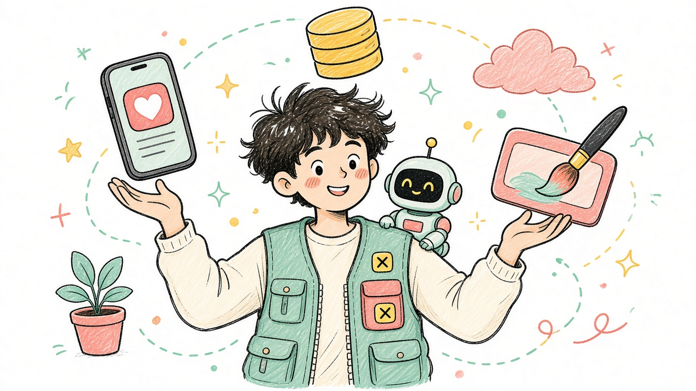

# Пара 1. В IT все становятся «универсальными солдатами»

<div align="center">



**Узкий «только кнопки красить» — уже мало.**  
Рынок всё чаще хочет человека, который тянет задачу целиком — с ИИ в рюкзаке.

</div>

---

## О чём метафора

«Универсальный солдат» в IT — не про войну.  
Про разработчика, который:

- понимает продукт шире своей узкой роли
- может закрыть соседний кусок работы
- умеет пользоваться ИИ как мультитулом
- доводит задачу от идеи до рабочего результата

Раньше ценили глубокого специалиста в одной щели.  
Сейчас рядом растёт спрос на **generalist + AI**: гибкого инженера, который двигается быстро.

---

## Почему так происходит

| Драйвер | Что меняется |
|---|---|
| **ИИ** | Рутину (шаблонный код, черновики, бойлерплейт) закрывает быстрее |
| **Меньше команд** | Стартапы и продукты хотят меньше людей на тот же объём |
| **Дороже джуны «в узкой роли»** | Компании реже держат чистых «только верстальщиков» / «только CRUD» |
| **Короткий цикл продукта** | Нужен человек, который сам пройдёт экран → API → баг → релиз |
| **Удалёнка / аутсорс** | Удобнее один сильный generalist, чем цепочка узких ролей |

Специалисты никуда не исчезли. Но **вход и рост** всё чаще идут через универсальность.

---

## Было → стало

| Раньше часто | Сейчас чаще ждут |
|---|---|
| «Я только frontend» | «Соберу фичу: UI + запрос к API + базовая ошибка» |
| «Я только пишу код» | «Пойму задачу, оценю, сделаю, проверю» |
| Толпа узких джунов | Меньше людей, шире зона ответственности |
| Знать один фреймворк | Уметь быстро войти в новый инструмент |
| Ждать дизайнера / бэкендера / DevOps | Сделать MVP самому, потом углубить |

---

## Что входит в «универсальный набор» 2026

Не нужно быть гением во всём. Нужен **скелет**:

1. **Продуктовое мышление** — зачем фича, кому больно
2. **Один сильный профиль** (у нас — мобилка / RN)
3. **Соседние слои на базовом уровне** — API, БД, Git, деплой «чтобы завелось»
4. **ИИ-грамотность** — спека → промпт → проверка → ответственность
5. **Коммуникация** — объяснить решение, написать README, пройти ревью

```text
T-shape:
  ─── широкий кругозор ───
           │
      глубокая ось
     (мобилка / RN)
```

Универсальный солдат = **T-shaped**, не «знаю всё по верхам и ничего по делу».

---

## ИИ делает универсальность реальной

Без ИИ «уметь всё» было почти невозможно.  
С ИИ реалистичный сценарий:

| Ты | ИИ |
|---|---|
| Ставишь цель и ограничения (SDD) | Генерит черновик экрана / эндпоинта |
| Проверяешь и правишь | Предлагает тесты / рефакторинг |
| Отвечаешь за прод и смысл | Ускоряет рутину |

Ты не заменяешься ИИ — ты становишься **командиром маленького отряда инструментов**.

---

## Опасности «универсала»

- Размазаться: 10 технологий по 5%, ни одной на защите
- Путать «ИИ сгенерил» с «я умею»
- Выгореть, таща чужие роли без границы
- Стать «человеком-оркестром» в плохой команде без роста

**Правило:** одна глубокая ось + осознанные соседние навыки.  
На курсе ось — **мобильная разработка**.

---

## Что это значит для студентов СВФУ

| Делать | Не делать |
|---|---|
| Вести одно приложение-портфолио весь семестр | Коллекционировать пустые туториалы |
| Понимать, как мобилка ходит в API | Учить только синтаксис JSX |
| Писать спеку и README | Сдавать код, который не объяснить |
| Трогать соседнее: auth, хранение, простая серверная логика | Бояться всего, что «не моя роль» |
| Использовать ИИ как ускоритель | Сдавать чужой непрочитанный код |

К концу курса идеальный образ:

> «Я могу сам довести фичу в Expo: экран → состояние → запрос → обработка ошибок → PR.»

Это и есть junior-level «универсальный солдат» для мобилки.

---

## Мини-чеклист универсала (на семестр)

- [ ] Есть ось: RN/Expo, хуки, навигация
- [ ] Понимаю HTTP и JSON на уровне «сам схожу в API»
- [ ] Умею оформить задачу спекой (SDD)
- [ ] GitHub выглядит как портфолио, не свалка
- [ ] Могу за 5 минут рассказать продукт целиком
- [ ] ИИ использую, но код на защите мой

---

## Итог одной фразой

В IT 2026 выигрывает не тот, кто знает одну кнопку лучше всех,  
а тот, кто **закрывает задачу** — с головой, с ИИ и с ответственностью.

Узкие сеньоры останутся.  
Но дорога к ним теперь часто идёт через роль универсального солдата.

---

*Раздатка к паре про ИИ и рынок. Метафора мягкая: про гибкость, не про милитаризм.*
